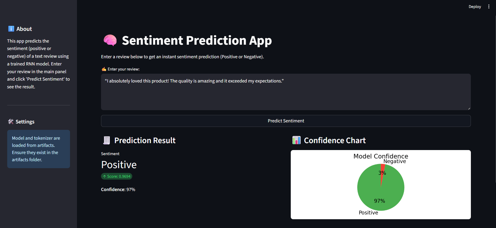

------------------------------------------------------------------------------------------------------------------------------------------------------------------------------------------------------------------------ |
| **Project Title**     | Positive & Negative Content Classification / Generation System                                                                                                                                                           |
| **Overview**          | A system designed to analyze, classify or generate positive and negative textual content. Useful for sentiment analysis projects, feedback classification, social media monitoring, and AI text generation applications. |
| **Key Features**      | ✔ Classifies text into Positive & Negative categories    ✔ Supports content generation    ✔ Easy to integrate and scalable                                                                                         |
| **Use Cases**         | Customer reviews analysis   Emotional tone classification   NLP research and experimentation   AI-based text generation                                                                                         |
| **Technologies Used** | Python, NLP, Machine Learning, Deep Learning (optional), Jupyter / Streamlit / Flask depending on implementation                                                                                                         |
| **Input Type**        | Raw text input                                                                                                                                                                                                           |
| **Output Type**       | Positive Content / Negative Content or Generated Sentences                                                                                                                                                               |
| **Workflow**          | 1️⃣ Input text   2️⃣ Processing & Sentiment Understanding   3️⃣ Classification / Generation   4️⃣ Output result                                                                                                 |
| **Advantages**        | Improves insight extraction, automates text analysis, enhances data-driven decision-making                                                                                                                               |
| **Future Scope**      | Multi-class emotions (joy, anger, sadness, fear, surprise), multilingual support, dashboard integration                                                                                                                  |
| **Author**            | Maruf                                                                                                                                                                                                                    |
| **Status**            | Active / Under Development                                                                                                                                                                                               |

Sentiment Analysis/
│
├── 📁 config/                     # Central configuration brain
│   └── model_config.yaml         # All hyperparameters, file paths, model settings:cite[1]
│
├── 📁 data/                      # Fantastic Four Module: Data:cite[3]
│   ├── __init__.py
│   ├── data_ingestion.py         # Loads data from sources (files, DB, APIs):cite[1]
│   ├── data_transformation.py    # Cleans, tokenizes, pre-processes text:cite[1]
│   └── dataset.py                # Defines PyTorch/TF Dataset classes
│
├── 📁 models/                    # Fantastic Four Module: Models:cite[3]
│   ├── __init__.py
│   ├── model_architecture.py     # Defines model classes (e.g., BERT classifier, LSTM)
│   └── load_pretrained.py        # Handles loading pre-trained weights
│
├── 📁 trainers/                  # Fantastic Four Module: Trainers:cite[3]
│   ├── __init__.py
│   ├── trainer.py                # Orchestrates the training loop, validation
│   ├── lr_scheduler.py           # Learning rate scheduling:cite[3]
│   └── logger.py                 # Logs metrics (e.g., to TensorBoard):cite[1]:cite[3]
│
├── 📁 experiments/               # Fantastic Four Module: Experiments:cite[3]
│   ├── __init__.py
│   └── train_pipeline.py         # Ties Data, Models, and Trainers together to run experiments:cite[3]
│
├── 📁 inference/                 # Dedicated module for making predictions
│   ├── __init__.py
│   └── predict_pipeline.py       # Loads a trained model and makes predictions on new data:cite[1]
│
├── 📁 utils/                     # Handy helper functions
│   ├── __init__.py
│   ├── helpers.py                # Common utility functions
│   └── exceptions.py             # Custom exception handling:cite[1]
│
├── 📁 notebooks/                 # Playground for exploration
│   ├── 01_eda.ipynb             # Exploratory Data Analysis
│   └── 02_prototyping.ipynb     # Initial model experimentation:cite[1]
│
├── 📁 tests/                     # For unit and integration tests
│   ├── test_data.py
│   └── test_models.py
│
├── 📁 deployment_documentation/  # Crucial for team deployment
│   └── local_setup.md           # Instructions to run the project locally:cite[1]
│
├── requirements.txt              # Project dependencies
├── setup.py                      # For installing the `src` package
└── README.md                     # Project overview and how to use it

